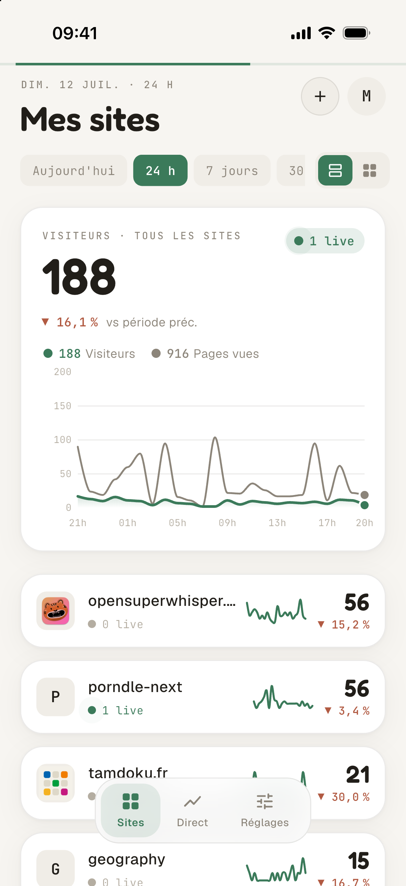
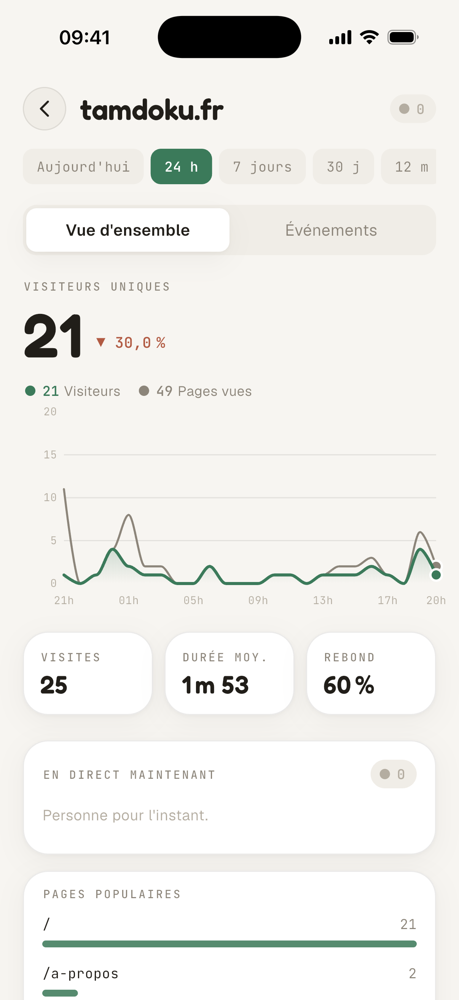
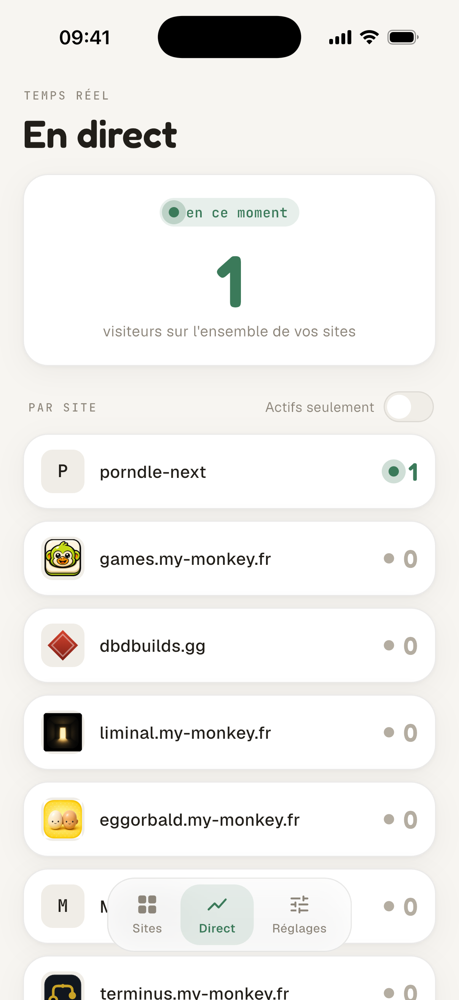
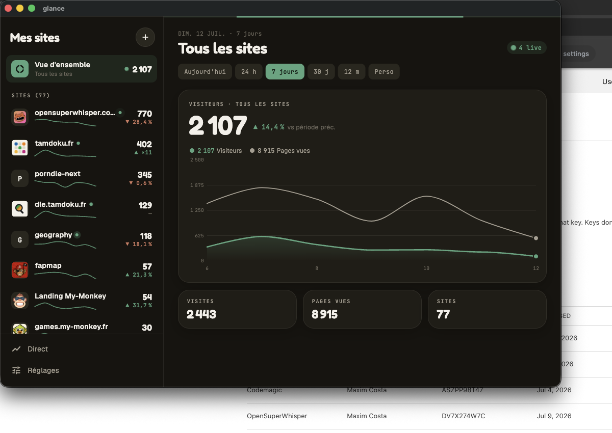
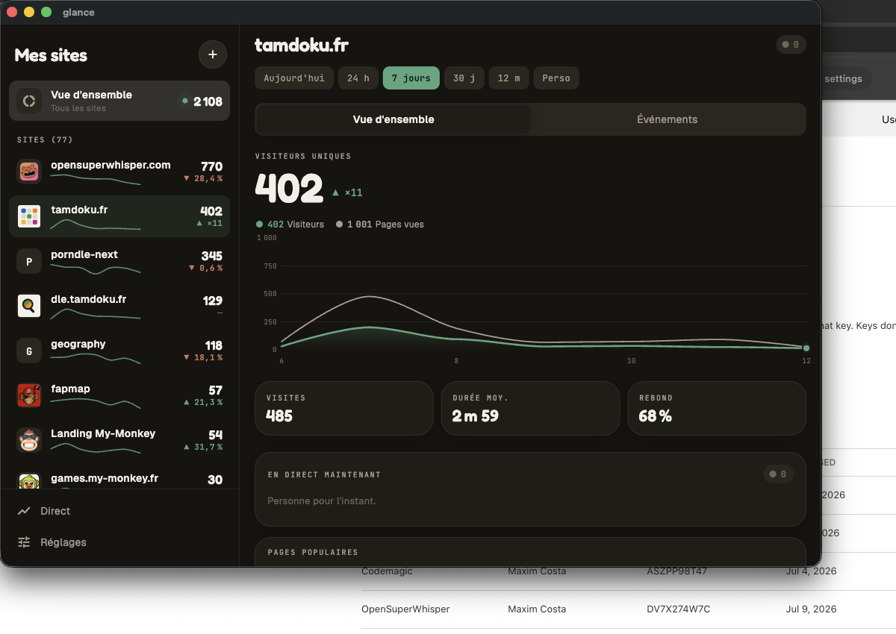
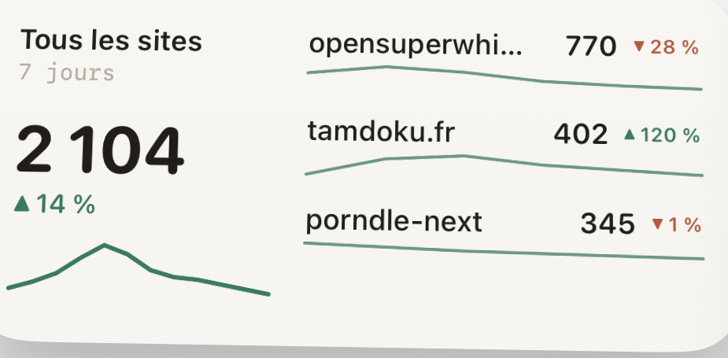
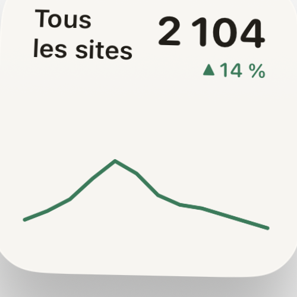
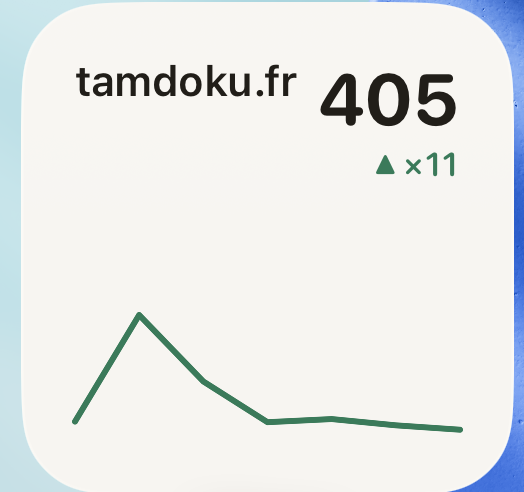

<div align="center">

# Glance

**Your analytics, at a glance.**

A clean, fast mobile & desktop client for your privacy-friendly web analytics —
[Umami](https://umami.is) and [Plausible](https://plausible.io) — with all your
sites in one place.

[](https://glance.my-monkey.fr)
[](LICENSE)
[](https://flutter.dev)

<br />


&nbsp;

&nbsp;


</div>

## The basics

- 📊 **All your sites in one place** — every website from every account, on a
  single screen, sorted by traffic.
- 🔌 **Multi-tool, multi-account** — connect Umami (self-hosted) or Plausible in
  seconds; add as many accounts as you like. Fathom is on the way.
- 📈 **Charts that read at a glance** — smooth visitors + page views curves,
  with periods from *today* to *12 months* (and a custom range).
- 🟢 **Real-time** — see who's on each of your sites right now.
- 🔎 **Per-site detail** — top pages, referrers, countries and custom events.
- 🖥️ **Everywhere** — iOS, Android, macOS and Windows, from the same codebase.
- 🔒 **Private by design** — your credentials stay on your device.

## Desktop

On a large screen, Glance turns into a master–detail workspace: the list of your
sites on the left, the overview or a site's full detail on the right — no page
juggling.

<div align="center">

<br /><br />

</div>

## Home screen widgets

Keep an eye on your traffic without opening the app. Glance ships iOS widgets in
every size, plus a configurable **per-site** widget where you pick which site to
watch.

<div align="center">

&nbsp;&nbsp;

&nbsp;&nbsp;

</div>

## Private by design

Glance talks **directly** to your analytics instance — nothing is proxied
through a third-party server. Your credentials are stored locally and encrypted
in the device keychain, and they never leave your device.

## Install

Glance is multi-platform. Availability by store:

- **iOS** — TestFlight today, App Store soon.
- **macOS** — via [Homebrew](https://brew.sh) (with the first public release):

  ```sh
  brew install --cask my-monkeys/tap/glance
  ```
- **Windows / Android** — coming soon.

Builds are published on the [Releases](https://github.com/my-monkeys/glance/releases)
page.

## Connect your analytics

### Umami (self-hosted, v3)
Enter your instance URL, username and password. Glance authenticates and pulls
every website you own (admin accounts see all sites).

### Plausible
Enter your instance URL, the domain to track and an API key.

> Fathom's interface is scaffolded and coming next.

## Building from source

Glance is a standard [Flutter](https://flutter.dev) app.

```sh
git clone https://github.com/my-monkeys/glance.git
cd glance
flutter pub get

# run on a connected device / simulator
flutter run

# or a desktop build
flutter run -d macos      # or: windows
```

Requires the Flutter SDK (Dart 3). iOS/macOS builds use CocoaPods.

## Contributing

Issues and pull requests are welcome. Glance is built by
[My-Monkey](https://my-monkey.fr), a small collective that likes shipping
slightly-too-ambitious ideas. 🍌

## License

[MIT](LICENSE) © My-Monkey
