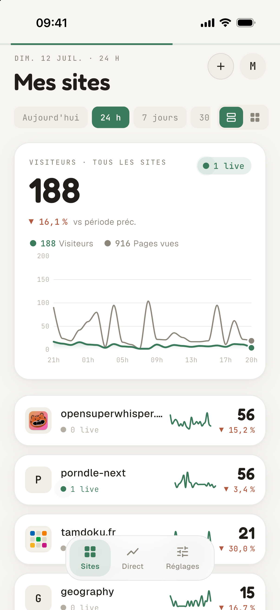
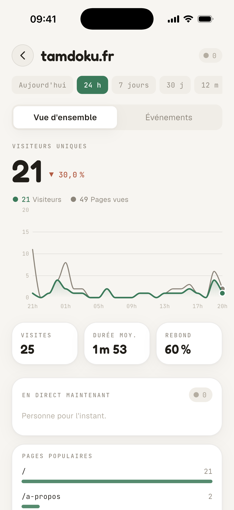
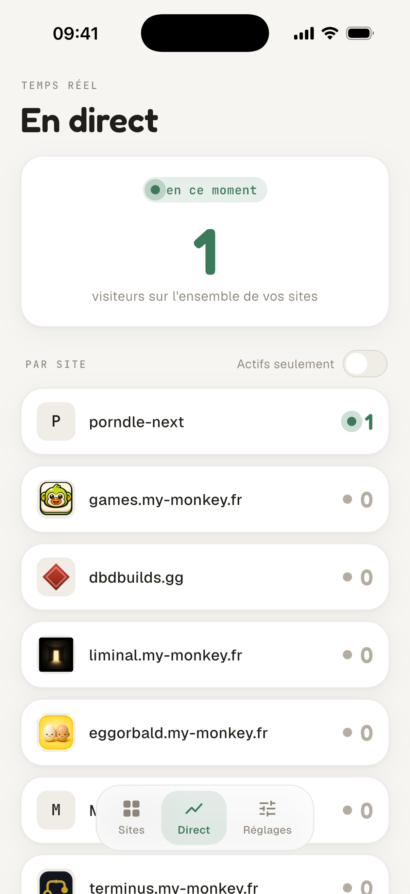
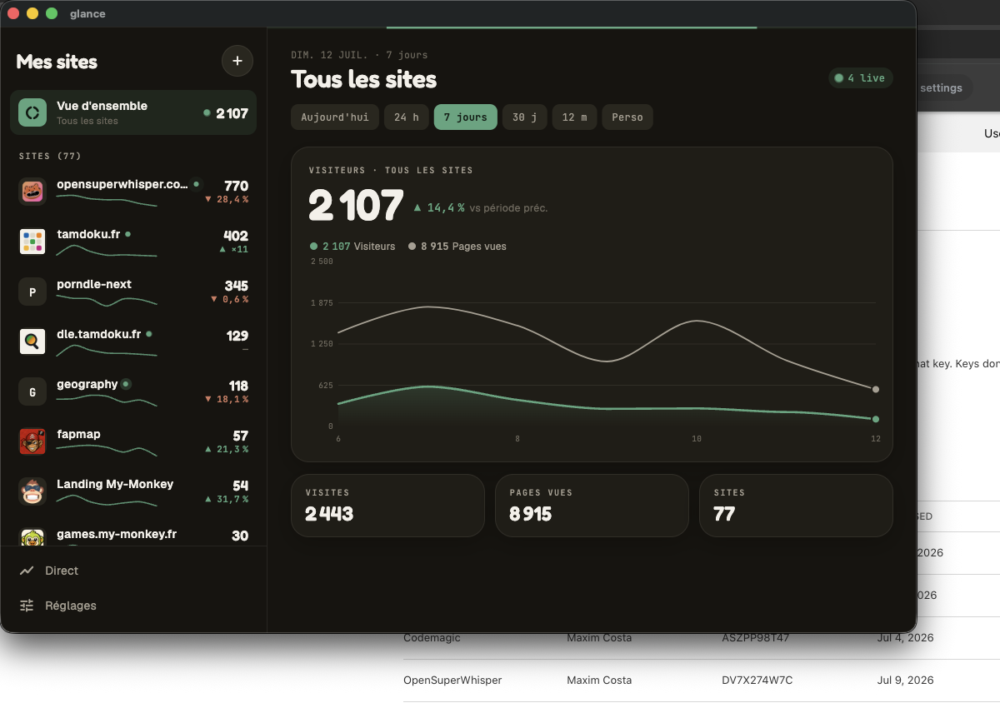
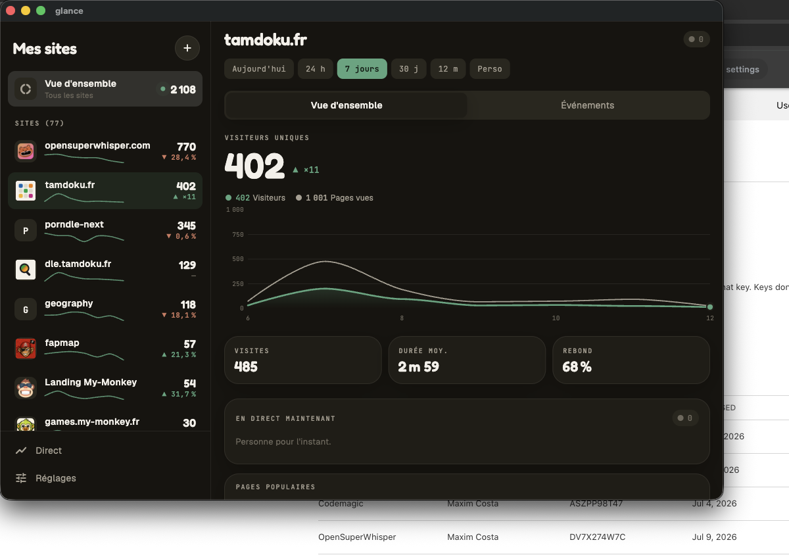
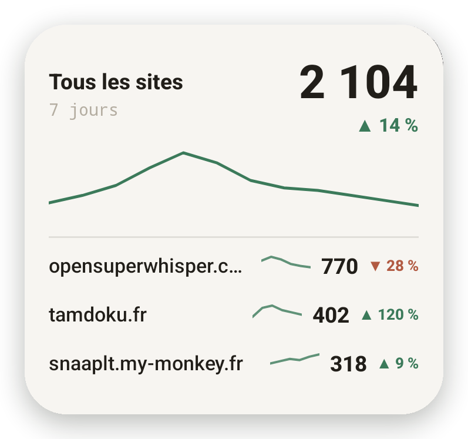
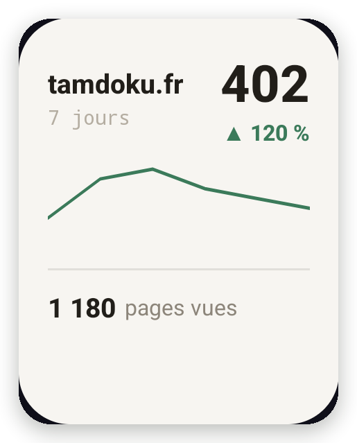

<div align="center">

# Glance

**Your analytics, at a glance.**

A clean, fast mobile & desktop client for your privacy-friendly web analytics —
[Umami](https://umami.is) and [Plausible](https://plausible.io) — with all your
sites in one place.

[](https://glance-analytics.com)
[](LICENSE)
[](https://flutter.dev)

<br />


&nbsp;

&nbsp;


</div>

## The basics

- 📊 **All your sites in one place** — every website from every account, on a
  single screen, sorted by traffic.
- 🔌 **Multi-tool, multi-account** — connect Umami (self-hosted) or Plausible in
  seconds; add as many accounts as you like. Fathom is on the way.
- 📈 **Charts that read at a glance** — smooth visitors + page views curves,
  across eight ranges from *today* to *this year* (plus a custom one).
- 🔮 **Forecast** — on a period still running, the curve keeps going as a dotted
  line: where today, this month or this year lands at the current pace.
- 🟢 **Real-time** — see who's on each of your sites right now.
- 🔎 **Per-site detail** — top pages, referrers, countries and custom events.
- 🔗 **Internal traffic** — the visitors your sites send each other, matched
  across every site you track.
- 🗂️ **Site groups** — a reading scope: totals, charts and live counts only
  count the sites in the group.
- 🖥️ **Everywhere** — iOS, Android, macOS and Windows, from the same codebase.
- 🔒 **Private by design** — your credentials stay on your device.

## Desktop

On a large screen, Glance turns into a master–detail workspace: the list of your
sites on the left, the overview or a site's full detail on the right — no page
juggling.

<div align="center">

<br /><br />

</div>

## Home screen widgets

Keep an eye on your traffic without opening the app. Glance ships home-screen
widgets on **iOS and Android** — an overview of all your sites, plus a
configurable **per-site** widget where you pick which site to watch.

<div align="center">

&nbsp;&nbsp;

</div>

## Your setup follows you

- **Site groups** — split your sites by client or by project. A group is a
  reading scope, so every number on screen only counts its sites.
- **QR transfer** — moving to a new device? Show an encrypted QR code, scan it
  from the other device: accounts, credentials and groups move across, without
  going through the network. Free.
- **Glance Sync** *(paid add-on, one-time purchase)* — backs up your accounts
  and groups and restores them on every device. Your setup is encrypted
  on-device **before** upload: the server only ever stores an unreadable blob.

## Private by design

Glance talks **directly** to your analytics instance — nothing is proxied
through a third-party server. Your credentials are stored locally and encrypted
in the device keychain, and they never leave your device. The only exception is
Glance Sync, which you opt into — and even then, what reaches the server is
encrypted end-to-end.

## Install

Glance is multi-platform:

- **iOS** — [App Store](https://apps.apple.com/app/glance-analytics/id6789938289)
- **Android** — [Play Store](https://play.google.com/store/apps/details?id=fr.mymonkey.glance)
- **macOS** — via [Homebrew](https://brew.sh) (auto-updates through Sparkle):

  ```sh
  brew install --cask my-monkeys/tap/glance
  ```

  Or grab the `.dmg` from the releases page. Requires macOS 12 (Monterey) or newer.
- **Windows** — the `.zip` from the releases page (x64).

Builds are published on the [Releases](https://github.com/my-monkeys/glance/releases)
page.

## Connect your analytics

### Umami (self-hosted, v3)
Enter your instance URL, username and password. Glance authenticates and pulls
every website you own (admin accounts see all sites).

### Plausible
Enter your instance URL, the domain to track and an API key.

> Fathom's interface is scaffolded and coming next.

## Building from source

Glance is a standard [Flutter](https://flutter.dev) app.

```sh
git clone https://github.com/my-monkeys/glance.git
cd glance
flutter pub get

# run on a connected device / simulator
flutter run

# or a desktop build
flutter run -d macos      # or: windows
```

Requires the Flutter SDK (Dart 3). iOS/macOS builds use CocoaPods.

## Contributing

Issues and pull requests are welcome. Glance is built by
[My-Monkey](https://my-monkey.fr), a small collective that likes shipping
slightly-too-ambitious ideas. 🍌

## License

[MIT](LICENSE) © My-Monkey
